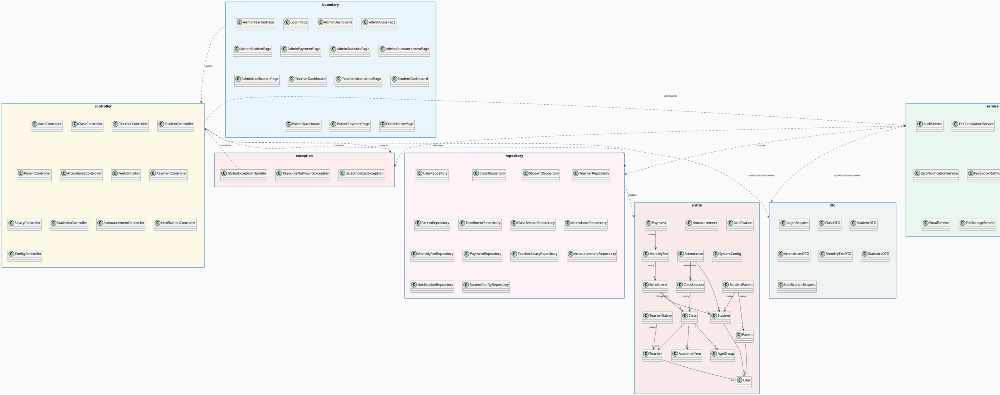
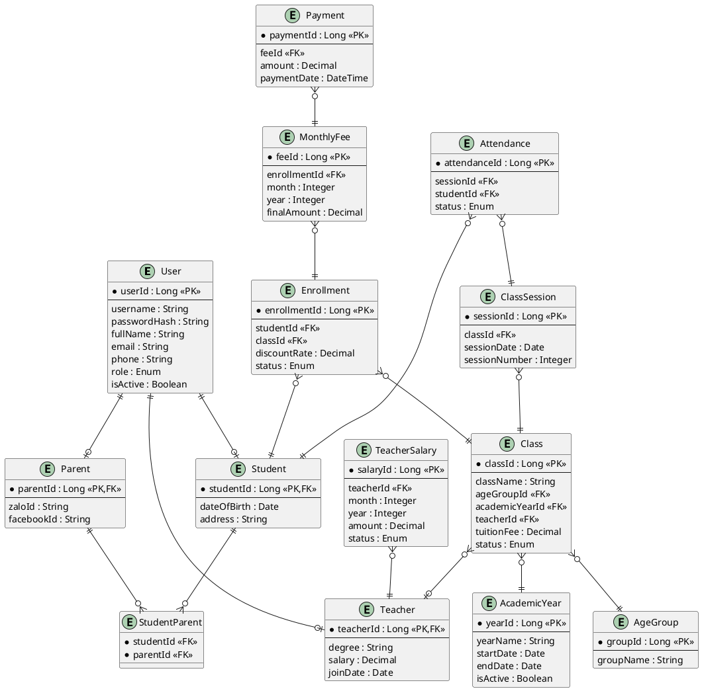

# He-thong-quan-li-trung-tam-tieng-anh
# 🏫 HỆ THỐNG QUẢN LÝ TRUNG TÂM TIẾNG ANH

> Ứng dụng web quản lý toàn diện cho trung tâm tiếng Anh: quản lý lớp học, giáo viên, học sinh, phụ huynh, điểm danh, học phí và thông báo.

---

## 📋 MỤC LỤC

1. [Tổng quan dự án]
2. [Chức năng – Use Case]
3. [Entity (Thực thể)]
4. [Các gói (Package)]
5. [Mối quan hệ giữa các gói – PlantUML]
6. [Công nghệ sử dụng]
7. [Cấu trúc thư mục]
8. [Yêu cầu cài đặt & Khởi chạy]
9. [Phân công công việc nhóm]
---

## 🎯 Tổng Quan

Hệ thống quản lý trung tâm tiếng Anh hỗ trợ 4 vai trò chính:

| Vai trò       | Mô tả                                                                     |
| ------------- | ------------------------------------------------------------------------- |
| **Admin**     | Quản lý toàn bộ hệ thống: lớp học, giáo viên, học sinh, học phí, thống kê |
| **Giáo viên** | Xem lịch dạy, điểm danh học sinh, theo dõi số buổi                        |
| **Học sinh**  | Xem thông tin lớp, lịch sử điểm danh                                      |
| **Phụ huynh** | Theo dõi học sinh, xem học phí, nhận thông báo                            |

---

## ✅ Chức Năng – Use Case

### 👤 UC-ADMIN: Quản trị viên

|Mã UC|Tên Use Case|Mô tả|
|---|---|---|
|UC-A01|Quản lý lớp học|Mở/đóng lớp theo năm học, tạo nhiều lớp cùng cấp độ (3.1, 3.2, ...)|
|UC-A02|Quản lý giáo viên|Thêm/sửa/xóa thông tin giáo viên, phân công giáo viên vào lớp|
|UC-A03|Quản lý học sinh|Thêm/sửa/xóa học sinh, xem danh sách học sinh mỗi lớp|
|UC-A04|Quản lý phụ huynh|Xem/sửa thông tin phụ huynh, liên kết phụ huynh với học sinh|
|UC-A05|Cấu hình học phí|Đặt mức học phí, cấu hình % giảm giá theo từng học sinh|
|UC-A06|Quản lý thanh toán|Ghi nhận thanh toán, xem lịch sử đóng tiền|
|UC-A07|Thống kê tài chính|Thống kê theo tháng/quý/năm/khoảng thời gian: doanh thu, học phí chưa thu, chi lương giáo viên|
|UC-A08|Thống kê học sinh|Theo dõi số học sinh tăng/giảm theo tháng|
|UC-A09|Quảng cáo/Thông báo|Đăng popup/slider thông báo lớp mới trên trang chủ|
|UC-A10|Cấu hình hiển thị|Bật/tắt hiển thị tên giáo viên cho phụ huynh|
|UC-A11|Gửi thông báo hàng loạt|Nhắn tin tự động qua Zalo/Facebook cho phụ huynh|

### 🧑‍🏫 UC-TEACHER: Giáo Viên

|Mã UC|Tên Use Case|Mô tả|
|---|---|---|
|UC-T01|Xem lịch dạy|Xem danh sách lớp được phân công|
|UC-T02|Điểm danh|Điểm danh học sinh theo từng buổi học|
|UC-T03|Xem thống kê buổi dạy|Xem số buổi đã dạy mỗi lớp|

### 🧑‍🎓 UC-STUDENT: Học Sinh

|Mã UC|Tên Use Case|Mô tả|
|---|---|---|
|UC-S01|Xem thông tin lớp|Xem tên lớp, giáo viên, lịch học|
|UC-S02|Xem lịch sử điểm danh|Xem số buổi đã học, số buổi vắng|

### 👪 UC-PARENT: Phụ Huynh

|Mã UC|Tên Use Case|Mô tả|
|---|---|---|
|UC-P01|Xem thông tin con|Xem lớp học, giáo viên (nếu admin bật cấu hình)|
|UC-P02|Xem lịch sử điểm danh|Xem chi tiết buổi vắng của con|
|UC-P03|Xem học phí|Xem học phí tháng, tổng nợ, tiền đã giảm|
|UC-P04|Đóng học phí|Ghi nhận số tiền đóng (có thể đóng một phần)|
|UC-P05|Nhận thông báo|Nhận thông báo qua Zalo/Facebook/SMS|

### 🔐 UC-AUTH: Xác Thực Chung

|Mã UC|Tên Use Case|Mô tả|
|---|---|---|
|UC-AUTH01|Đăng nhập|Xác thực theo vai trò|
|UC-AUTH02|Đăng xuất|Hủy phiên làm việc|
|UC-AUTH03|Đổi mật khẩu|Cập nhật mật khẩu tài khoản|

---

## 🗃️ Entity (Thực Thể)

### User (Người Dùng – Base)

```
User
├── userId         : Long (PK)
├── username       : String
├── passwordHash   : String
├── fullName       : String
├── email          : String
├── phone          : String
├── role           : Enum {ADMIN, TEACHER, STUDENT, PARENT}
├── isActive       : Boolean
├── createdAt      : DateTime
└── updatedAt      : DateTime
```

### AcademicYear (Năm Học)

```
AcademicYear
├── yearId         : Long (PK)
├── yearName       : String       -- VD: "2024-2025"
├── startDate      : Date
├── endDate        : Date
└── isActive       : Boolean
```

### AgeGroup (Cấp Độ / Lứa Tuổi)

```
AgeGroup
├── groupId        : Long (PK)
├── groupName      : String       -- VD: "Lớp 3", "Lớp 4", "Beginner"
└── description    : String
```

### Class (Lớp Học)

```
Class
├── classId        : Long (PK)
├── className      : String       -- VD: "Lớp 3.1"
├── ageGroupId     : Long (FK → AgeGroup)
├── academicYearId : Long (FK → AcademicYear)
├── teacherId      : Long (FK → Teacher)
├── maxStudents    : Integer
├── schedule       : String       -- Lịch học (VD: "T2-T4-T6, 18:00-19:30")
├── tuitionFee     : Decimal      -- Học phí gốc mỗi tháng
├── status         : Enum {OPEN, CLOSED}
├── createdAt      : DateTime
└── updatedAt      : DateTime
```

### Teacher (Giáo Viên)

- Lớp con của lớp User
```
Teacher
├── teacherId      : Long (PK, FK → User)
├── degree         : String
├── specialization : String
├── salary         : Decimal
└── joinDate       : Date
```

### Student (Học Sinh)

- Lớp con của lớp User
```
Student
├── studentId      : Long (PK, FK → User)
├── dateOfBirth    : Date
├── address        : String
└── enrollDate     : Date
```

### Parent (Phụ Huynh)

- Lớp con của lớp User
```
Parent
├── parentId       : Long (PK, FK → User)
├── zaloId         : String
├── facebookId     : String
└── relationship   : String       -- "Bố", "Mẹ", ...
```

### StudentParent (Liên Kết Học Sinh – Phụ Huynh)

- 1 phụ huynh có thể có nhiều học sinh
```
StudentParent
├── studentId      : Long (FK → Student)
└── parentId       : Long (FK → Parent)
```

### Enrollment (Đăng Ký Học)

```
Enrollment
├── enrollmentId   : Long (PK)
├── studentId      : Long (FK → Student)
├── classId        : Long (FK → Class)
├── discountRate   : Decimal      -- % giảm học phí (VD: 0.10 = 10%)
├── enrollDate     : Date
└── status         : Enum {ACTIVE, INACTIVE}
```

### ClassSession (Buổi Học)

```
ClassSession
├── sessionId      : Long (PK)
├── classId        : Long (FK → Class)
├── sessionDate    : Date
├── sessionNumber  : Integer
├── note           : String
└── createdBy      : Long (FK → User)
```

### Attendance (Điểm Danh)

```
Attendance
├── attendanceId   : Long (PK)
├── sessionId      : Long (FK → ClassSession)
├── studentId      : Long (FK → Student)
├── status         : Enum {PRESENT, ABSENT, LATE}
└── note           : String
```

### MonthlyFee (Học Phí Tháng)

```
MonthlyFee
├── feeId          : Long (PK)
├── enrollmentId   : Long (FK → Enrollment)
├── month          : Integer
├── year           : Integer
├── totalSessions  : Integer
├── originalAmount : Decimal
├── discountAmount : Decimal
├── finalAmount    : Decimal
└── dueDate        : Date
```

### Payment (Thanh Toán)

```
Payment
├── paymentId      : Long (PK)
├── feeId          : Long (FK → MonthlyFee)
├── amount         : Decimal
├── paymentDate    : DateTime
├── method         : Enum {CASH, TRANSFER}
├── receivedBy     : Long (FK → User)
└── note           : String
```

### TeacherSalary (Lương Giáo Viên)

```
TeacherSalary
├── salaryId       : Long (PK)
├── teacherId      : Long (FK → Teacher)
├── month          : Integer
├── year           : Integer
├── totalSessions  : Integer
├── amount         : Decimal
├── paidDate       : Date
└── status         : Enum {PENDING, PAID}
```

### Announcement (Thông Báo / Quảng Cáo)

```
Announcement
├── announcementId : Long (PK)
├── title          : String
├── content        : Text
├── imageUrl       : String
├── type           : Enum {POPUP, SLIDER, BANNER}
├── startDate      : Date
├── endDate        : Date
├── isActive       : Boolean
└── createdBy      : Long (FK → User)
```

### Notification (Tin Nhắn Tự Động)

```
Notification
├── notificationId : Long (PK)
├── recipientId    : Long (FK → User)
├── channel        : Enum {ZALO, FACEBOOK, SMS, EMAIL}
├── message        : Text
├── status         : Enum {PENDING, SENT, FAILED}
├── sentAt         : DateTime
└── createdAt      : DateTime
```

### SystemConfig (Cấu Hình Hệ Thống)

```
SystemConfig
├── configKey      : String (PK)
└── configValue    : String       -- VD: "show_teacher_to_parent" = "true"
```

---

## 📦 Các Gói (Package)

### 1. Package `boundary` – Giao Diện Người Dùng

Chứa các lớp xử lý hiển thị giao diện (View / Page / Screen).

| Lớp                     | Chức năng                                      |
| ----------------------- | ---------------------------------------------- |
| `LoginPage`             | Form đăng nhập, xác định vai trò và điều hướng |
| `AdminDashboard`        | Trang tổng quan cho admin: thống kê nhanh      |
| `AdminClassPage`        | Quản lý danh sách lớp học                      |
| `AdminTeacherPage`      | Quản lý danh sách giáo viên                    |
| `AdminStudentPage`      | Quản lý danh sách học sinh                     |
| `AdminParentPage`       | Quản lý danh sách phụ huynh                    |
| `AdminPaymentPage`      | Quản lý học phí và thanh toán                  |
| `AdminStatisticsPage`   | Trang thống kê tài chính, học sinh             |
| `AdminAnnouncementPage` | Quản lý popup/slider quảng cáo                 |
| `AdminNotificationPage` | Gửi thông báo hàng loạt                        |
| `TeacherDashboard`      | Trang chủ giáo viên: lịch dạy, lớp phụ trách   |
| `TeacherAttendancePage` | Giao diện điểm danh theo buổi                  |
| `StudentDashboard`      | Trang chủ học sinh: lớp học, lịch sử điểm danh |
| `ParentDashboard`       | Trang chủ phụ huynh: thông tin con, học phí    |
| `ParentPaymentPage`     | Xem và xác nhận đóng học phí                   |
| `PublicHomePage`        | Trang chủ công khai: slider, thông báo lớp mới |

---

### 2. Package `controller` – Xử Lý Nghiệp Vụ

Điều phối luồng dữ liệu giữa boundary và entity.

| Lớp                      | Chức năng                                                           |
| ------------------------ | ------------------------------------------------------------------- |
| `AuthController`         | Xử lý đăng nhập, đăng xuất, phân quyền, đổi mật khẩu                |
| `ClassController`        | Tạo/đóng lớp, phân công giáo viên, lấy danh sách lớp                |
| `TeacherController`      | CRUD giáo viên, tính số buổi dạy                                    |
| `StudentController`      | CRUD học sinh, đăng ký lớp, cấu hình giảm học phí                   |
| `ParentController`       | CRUD phụ huynh, liên kết với học sinh                               |
| `AttendanceController`   | Tạo buổi học, ghi/sửa điểm danh, thống kê vắng                      |
| `FeeController`          | Tính học phí tháng (theo số buổi + % giảm), xem công nợ             |
| `PaymentController`      | Ghi nhận thanh toán, lịch sử thanh toán                             |
| `SalaryController`       | Tính và ghi nhận lương giáo viên                                    |
| `StatisticsController`   | Thống kê tài chính (thu/chi) theo tháng/quý/năm; thống kê học sinh  |
| `AnnouncementController` | Tạo/sửa/xóa/kích hoạt popup & slider                                |
| `NotificationController` | Tổng hợp danh sách người nhận, soạn tin nhắn tự động, điều phối gửi |
| `ConfigController`       | Đọc/ghi cấu hình hệ thống (show_teacher, ...)                       |

---

### 3. Package `entity` – Lớp Thực Thể / Model

Ánh xạ trực tiếp với bảng CSDL (ORM).

| Lớp             | Chức năng                              |
| --------------- | -------------------------------------- |
| `User`          | Thực thể người dùng chung              |
| `AcademicYear`  | Năm học                                |
| `AgeGroup`      | Cấp độ/lứa tuổi                        |
| `Class`         | Lớp học                                |
| `Teacher`       | Giáo viên (mở rộng User)               |
| `Student`       | Học sinh (mở rộng User)                |
| `Parent`        | Phụ huynh (mở rộng User)               |
| `StudentParent` | Quan hệ học sinh – phụ huynh           |
| `Enrollment`    | Đăng ký học (liên kết Student – Class) |
| `ClassSession`  | Buổi học cụ thể                        |
| `Attendance`    | Điểm danh từng buổi                    |
| `MonthlyFee`    | Học phí tháng                          |
| `Payment`       | Thanh toán                             |
| `TeacherSalary` | Lương giáo viên                        |
| `Announcement`  | Thông báo/quảng cáo trang chủ          |
| `Notification`  | Lịch sử tin nhắn tự động               |
| `SystemConfig`  | Cấu hình hệ thống                      |


---

### 4. Package `repository` (DAO) – Truy Cập Dữ Liệu

|Lớp|Chức năng|
|---|---|
|`UserRepository`|Truy vấn người dùng theo vai trò, username|
|`ClassRepository`|Tìm lớp theo năm, cấp độ, trạng thái|
|`TeacherRepository`|Danh sách giáo viên, lớp của giáo viên|
|`StudentRepository`|Danh sách học sinh theo lớp, tìm kiếm|
|`ParentRepository`|Tra cứu phụ huynh theo học sinh|
|`EnrollmentRepository`|Lấy danh sách đăng ký, cấu hình giảm giá|
|`ClassSessionRepository`|Danh sách buổi học theo lớp, tháng|
|`AttendanceRepository`|Lấy điểm danh theo buổi/học sinh/tháng|
|`MonthlyFeeRepository`|Học phí theo tháng, công nợ chưa đóng|
|`PaymentRepository`|Lịch sử thanh toán|
|`TeacherSalaryRepository`|Lịch sử lương theo giáo viên, kỳ|
|`AnnouncementRepository`|Lấy thông báo đang kích hoạt|
|`NotificationRepository`|Lưu/truy vấn lịch sử thông báo|
|`SystemConfigRepository`|Đọc/ghi cấu hình|

---

### 5. Package `service` – Dịch Vụ Nghiệp Vụ Phức Tạp

| Lớp                           | Chức năng                                                    |
| ----------------------------- | ------------------------------------------------------------ |
| `FeeCalculationService`       | Tính học phí = (số buổi × đơn giá buổi) × (1 − discountRate) |
| `StatisticsService`           | Tổng hợp báo cáo tài chính, số lượng học sinh theo kỳ        |
| `ZaloNotificationService`     | Gửi tin nhắn qua Zalo API(chọn cái này)                      |
| `FacebookNotificationService` | Gửi tin nhắn qua Facebook Messenger API(bỏ qua)              |
| `SmsNotificationService`      | Gửi SMS qua Twilio/ESMS(bỏ qua)                              |
| `EmailService`                | Gửi email thông báo(bỏ qua)                                  |
| `AuthService`                 | Mã hóa mật khẩu, tạo JWT token, xác thực                     |
| `FileStorageService`          | Upload/lưu trữ file ảnh (avatar, banner)                     |

---

### 6. Package `dto` – Data Transfer Object

|Lớp|Chức năng|
|---|---|
|`LoginRequest / LoginResponse`|Thông tin đăng nhập và JWT token|
|`ClassDTO`|Dữ liệu lớp học truyền tới giao diện|
|`StudentDTO`|Thông tin học sinh rút gọn|
|`AttendanceDTO`|Thông tin điểm danh buổi học|
|`MonthlyFeeDTO`|Học phí tháng đã tính (gốc, giảm, thực thu)|
|`StatisticsDTO`|Kết quả thống kê tài chính|
|`NotificationRequest`|Yêu cầu gửi thông báo (đối tượng, kênh, nội dung)|

---

### 7. Package `exception` – Xử Lý Ngoại Lệ

| Lớp                         | Chức năng                              |
| --------------------------- | -------------------------------------- |
| `UnauthorizedException`     | Không có quyền truy cập                |
| `ResourceNotFoundException` | Không tìm thấy tài nguyên              |
| `InvalidDataException`      | Dữ liệu đầu vào không hợp lệ           |
| `GlobalExceptionHandler`    | Bắt và chuẩn hóa tất cả lỗi trả về API |

---

## 🔗 Mối Quan Hệ Giữa Các Gói – PlantUML

Lưu đoạn code sau vào file `packages.puml` rồi render bằng PlantUML.



---

### Sơ đồ Entity Relationship (ERD PlantUML)



---

## 🛠️ Công Nghệ Sử Dụng

### Backend

|Thành phần|Công nghệ đề xuất|
|---|---|
|Ngôn ngữ|Java 17+ hoặc Node.js 18+ hoặc PHP 8+|
|Framework|Spring Boot 3.x (Java) / Express.js / Laravel|
|ORM|Spring Data JPA + Hibernate / Sequelize / Eloquent|
|Xác thực|JWT (JSON Web Token) + Spring Security|
|API|RESTful API (JSON)|
|Docs API|Swagger / OpenAPI 3.0|

### Frontend

|Thành phần|Công nghệ đề xuất|
|---|---|
|Framework|React.js 18+ hoặc Vue.js 3|
|UI Library|Ant Design / Material UI / Tailwind CSS|
|State Management|Redux Toolkit / Pinia|
|HTTP Client|Axios|
|Charts/Stats|Chart.js / Recharts / ApexCharts|
|Popup/Slider|Swiper.js / SweetAlert2|

### Cơ Sở Dữ Liệu

|Thành phần|Công nghệ|
|---|---|
|RDBMS|MySQL 8+ hoặc PostgreSQL 15+|
|Migration|Flyway / Liquibase|
|Cache|Redis (tuỳ chọn, cho thống kê)|

### Tích Hợp Thông Báo

|Kênh|API / SDK|
|---|---|
|Zalo|Zalo Official Account API|
|Facebook|Facebook Messenger API (Page)|
|SMS|Esms.vn / Twilio|
|Email|SendGrid / SMTP Gmail|

### Hạ Tầng & DevOps

|Thành phần|Công nghệ|
|---|---|
|Containerization|Docker + Docker Compose|
|CI/CD|GitHub Actions|
|Cloud (tuỳ chọn)|AWS EC2 / DigitalOcean / Railway|
|File Storage|AWS S3 / Cloudinary / Local|
|Logging|Logback / Winston|

---

## 📁 Cấu Trúc Thư Mục

```
english-center/
├── backend/
│   ├── src/
│   │   ├── main/java/com/englishcenter/
│   │   │   ├── boundary/          # (nếu dùng MVC truyền thống / Thymeleaf)
│   │   │   ├── controller/        # REST Controllers
│   │   │   ├── service/           # Business Logic
│   │   │   ├── repository/        # Spring Data JPA Repositories
│   │   │   ├── entity/            # JPA Entities
│   │   │   ├── dto/               # Data Transfer Objects
│   │   │   ├── exception/         # Custom Exceptions
│   │   │   ├── config/            # Security, Swagger, CORS config
│   │   │   └── EnglishCenterApp.java
│   │   └── resources/
│   │       ├── application.yml
│   │       └── db/migration/      # Flyway SQL scripts
│   ├── Dockerfile
│   └── pom.xml
│
├── frontend/
│   ├── src/
│   │   ├── pages/                 # boundary – các trang giao diện
│   │   ├── components/            # Shared UI components
│   │   ├── store/                 # State management
│   │   ├── services/              # API calls (axios)
│   │   ├── router/                # Route + Auth Guard
│   │   └── App.jsx
│   ├── Dockerfile
│   └── package.json
│
├── docker-compose.yml
└── README.md
```

---

## ⚙️ Yêu Cầu Cài Đặt & Khởi Chạy

### Yêu cầu môi trường

- Java 17+ (hoặc Node.js 18+)
- MySQL 8+ hoặc PostgreSQL 15+
- Node.js 18+ (cho frontend)
- Docker & Docker Compose (tuỳ chọn)

### Cài đặt nhanh với Docker

```bash
# 1. Clone project
git clone https://github.com/your-team/english-center.git
cd english-center

# 2. Cấu hình biến môi trường
cp .env.example .env
# Chỉnh sửa DB_HOST, DB_PASS, JWT_SECRET, ZALO_OA_TOKEN, ...

# 3. Khởi chạy toàn bộ
docker-compose up -d

# 4. Truy cập
# Frontend: http://localhost:3000
# Backend API: http://localhost:8080/api
# Swagger UI: http://localhost:8080/swagger-ui.html
```

### Cài đặt thủ công

```bash
# === BACKEND ===
cd backend
cp src/main/resources/application.example.yml src/main/resources/application.yml
# Điền thông tin DB vào application.yml
./mvnw spring-boot:run

# === FRONTEND ===
cd frontend
npm install
cp .env.example .env.local
# Điền VITE_API_URL=http://localhost:8080/api
npm run dev
```

### Tài khoản mặc định (seed data)

|Vai trò|Username|Password|
|---|---|---|
|Admin|`admin`|`Admin@123`|
|Giáo viên|`teacher01`|`Teacher@123`|
|Học sinh|`student01`|`Student@123`|
|Phụ huynh|`parent01`|`Parent@123`|

---

## 👥 Phân Công Công Việc Nhóm

|Thành viên|Phụ trách|
|---|---|
|**Thành viên 1**|Database design, Backend: Auth, Class, Teacher, Student modules|
|**Thành viên 2**|Backend: Attendance, Fee, Payment, Statistics, Notification modules|
|**Thành viên 3**|Frontend: Toàn bộ giao diện (Admin, Teacher, Student, Parent), Tích hợp API|

> _Điều chỉnh phân công theo thực tế nhóm (tối đa 3 sinh viên/nhóm)_

---

## 📌 Lưu Ý Quan Trọng

- **Không được xóa dữ liệu lịch sử**: Khi đóng lớp, chỉ cập nhật `status = CLOSED`, không xóa bản ghi.
- **Học phí linh hoạt**: Hỗ trợ đóng một phần; tổng nợ = Σ(finalAmount) - Σ(payment.amount).
- **Phân quyền chặt chẽ**: Mỗi API endpoint phải kiểm tra JWT role trước khi xử lý.
- **Nộp bài**: Gửi mail cho thầy trước **01 tuần** so với buổi học cuối cùng (project + hướng dẫn cài đặt).
- **Không sao chép**: Tham khảo được nhưng tuyệt đối không copy toàn bộ dự án khác.

---

_README được tổng hợp từ đề tài "Xây dựng website quản lý trung tâm tiếng Anh" – Môn Lập trình Web_

---

## 🚀 Quy Trình Phát Triển Chi Tiết (Build -> Test -> Deploy)

> Trạng thái hiện tại của repo: đã có khung backend/frontend + migration DB, chưa hoàn thiện module nghiệp vụ và chưa có bộ test tự động.

### 1) Chuẩn bị môi trường phát triển

1. Cài công cụ:
   - Java 17+
   - Maven 3.9+
   - Node.js 20 LTS + npm
   - Docker Desktop + Docker Compose
   - MySQL 8 (nếu không dùng Docker DB)
2. Clone repo và vào thư mục dự án:
   ```bash
   git clone https://github.com/Baronphviet/He-thong-quan-li-trung-tam-tieng-anh.git
   cd He-thong-quan-li-trung-tam-tieng-anh
   ```
3. Tạo branch làm việc:
   ```bash
   git checkout -b feature/<ten-chuc-nang>
   ```

### 2) Chạy local (ưu tiên Docker)

1. Chạy toàn bộ hệ thống:
   ```bash
   docker compose up --build
   ```
2. Truy cập:
   - Frontend: `http://localhost:3000`
   - Backend: `http://localhost:8080`
3. Kiểm tra nhanh:
   - Backend container lên thành công
   - Flyway chạy migration `V1__init_schema.sql`
   - Frontend load được trang chính

> Nếu chạy thủ công:
> - Backend: `cd backend && mvn spring-boot:run`
> - Frontend: `cd frontend && npm install && npm run dev`

### 3) Quy tắc triển khai chức năng (theo từng module)

Mỗi module nên làm theo thứ tự:
1. DB migration (nếu cần) trong `backend/src/main/resources/db/migration`
2. Entity + Repository
3. Service (business logic)
4. DTO + Validation
5. Controller (REST API)
6. Exception handling
7. Frontend service gọi API
8. Frontend page/component

Áp dụng theo nhóm use case:
- Nhóm 1: Auth, User/Role
- Nhóm 2: Class, Student, Teacher, Parent
- Nhóm 3: Attendance, Fee, Payment
- Nhóm 4: Statistics, Announcement, Notification

### 4) Build

1. Backend:
   ```bash
   cd backend
   mvn clean package
   ```
   Artifact: `backend/target/backend-0.0.1-SNAPSHOT.jar`

2. Frontend:
   ```bash
   cd frontend
   npm install
   npm run build
   ```
   Artifact: `frontend/dist/`

3. Docker images:
   ```bash
   docker compose build
   ```

### 5) Test (quy chuẩn trước khi merge)

Hiện repo chưa có test case; cần bổ sung theo tối thiểu sau:

1. Backend unit test (Service):
   - AuthService
   - FeeCalculationService
   - StatisticsService

2. Backend integration test (Controller + DB):
   - Đăng nhập
   - CRUD lớp học
   - Điểm danh
   - Ghi nhận thanh toán

3. Frontend test:
   - Render route chính
   - API service layer
   - E2E flow đăng nhập -> dashboard

Lệnh đề xuất:
```bash
# backend
cd backend
mvn test

# frontend (sau khi thêm test framework)
cd frontend
npm test
```

### 6) CI/CD đề xuất (GitHub Actions)

1. Trigger:
   - Pull Request vào `main`: chạy CI (build + test)
   - Push/merge `main`: build image + deploy

2. CI pipeline:
   - Setup JDK 17 và Node 20
   - `mvn -B test package`
   - `npm ci && npm run build` (và `npm test` khi đã có test)

3. CD pipeline:
   - Build + push Docker images
   - SSH vào server chạy `docker compose pull && docker compose up -d`
   - Chạy smoke test sau deploy

### 7) Deploy môi trường staging/production

1. Chuẩn bị server:
   - Linux VM (Ubuntu 22.04+)
   - Docker + Docker Compose
   - Reverse proxy Nginx (HTTPS)

2. Biến môi trường production cần có:
   - `DB_URL`
   - `DB_USERNAME`
   - `DB_PASSWORD`
   - `JWT_SECRET` (khi tích hợp auth JWT)
   - Các token tích hợp thông báo (nếu bật)

3. Quy trình deploy:
   ```bash
   docker compose pull
   docker compose up -d
   docker compose ps
   ```

4. Checklist sau deploy:
   - API phản hồi 200 ở endpoint health
   - Frontend gọi được API
   - Không có lỗi Flyway/JPA trong log

### 8) Quy trình release và rollback

1. Release:
   - Tag version: `v0.1.0`, `v0.2.0`, ...
   - Ghi changelog ngắn cho mỗi bản phát hành

2. Rollback khi lỗi:
   - Quay về image/tag trước
   - `docker compose up -d` lại theo tag cũ
   - Kiểm tra DB migration có tương thích rollback hay không

### 9) Definition of Done (DoD)

Một chức năng chỉ được xem là hoàn thành khi:
1. Có migration + API + UI
2. Chạy local qua Docker thành công
3. Có test cho logic chính
4. Qua CI không lỗi
5. Được review và merge PR
